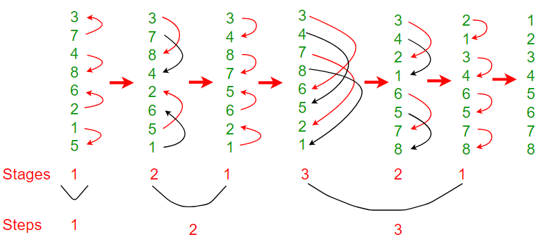

## Time Complex - O(n Log 2n)

The number of comparisons done by Bitonic sort are more than popular sorting algorithms like Merge Sort *[ does O(nLogn) comparisons]*, but Bitonice sort is better for parallel implementation because we always compare elements in predefined sequence and the sequence of comparison doesn’t depend on data. Therefore it is suitable for implementation in hardware and parallel processor array.
Bitonic Sort must be done if number of elements to sort are 2^n. The procedure of bitonic sequence fails if the number of elements are not in aforementioned quantity precisely.

